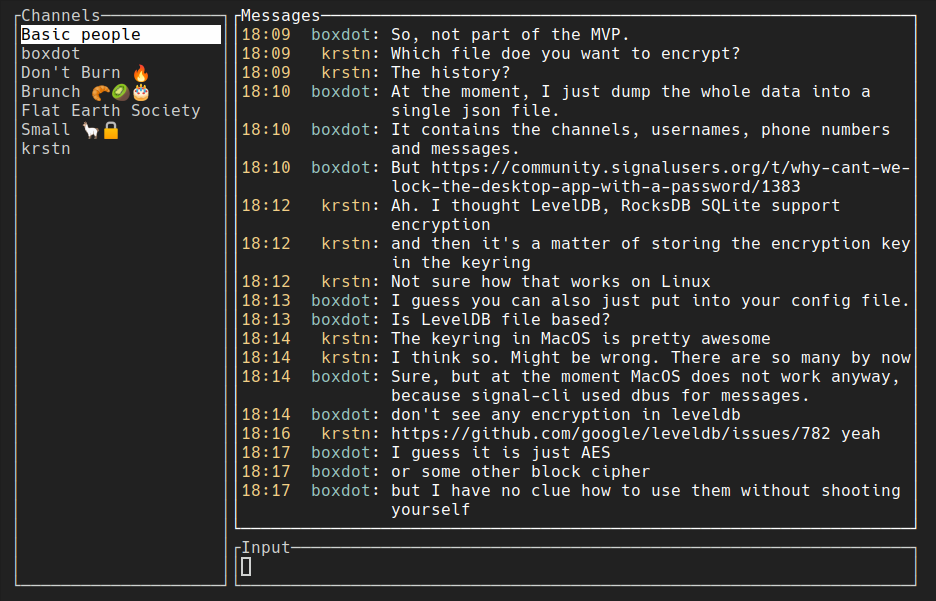

# gurk 🥒
![CI][ci-badge] [![chat][chat-badge]][chat-link]

[Signal Messenger] client for terminal.



# Installation

## Pre-compiled binary

Download a pre-compiled binary from [Releases] for following targets:

* `x86-64 Linux GNU`
* `x86-64 Linux musl`
* `aarch64 Linux GNU`
* `aarch64 Linux musl` (>= `v0.2.4` only)
* `x86-64 Darwin`
* `aarch64 Darwin`

## From source (using `cargo`)

```shell
cargo install --git https://github.com/boxdot/gurk-rs gurk
```

## Arch Linux

Packaged in the AUR: `gurk-git` and `gurk-bin`

## Nix/NixOS

Either per user:

```
$ nix-env --install gurk-rs
```

or system-wide:

```nix
environment.systemPackages = with pkgs; [ gurk-rs ];
```

# Usage

Run

```
gurk
```

On the first run, it will open a QR code in your favorite image viewer, such that you can link the
client as a new device. This will also create a configuration file at the default [config
location][config-location]. For the configuration directives, see [`src/config.rs`].

Note: The binary cannot be published on crates.io, because it depends on several official Signal
libraries that are not available on crates.io.

## Chat

[][chat-link]

## Features

* [ ] Store data in the db from [`presage`]'s `Manager` instead of a JSON file.
* [ ] Encrypt the storage by default.
* [x] Notifications over dbus or similar.
* [x] Scrolling of messages.
* [x] Reply functionality to a single message.
* [ ] Mouse navigation (works for channels, missing for the messages list).
* [ ] Search of messages/chats. Add quick switch between chats by name.
* [x] Multiline messages; the `Enter` key sends the message, `Alt+Enter` switches modes.
* [x] Viewing/sending of attachments.
* [ ] Support for blocked contacts/groups.
* [x] Reactions with emojis.
* [x] Open URL in selected message.

# Key bindings

* App navigation
  * `f1` Toggle help panel.
* Message input
  * `tab` Send emoji from input line as reaction on selected message.
  * `alt+enter` Switch between multi-line and singl-line input modes.
  * `alt+left`, `alt+right` Jump to previous/next word.
  * `ctrl+w / ctrl+backspace / alt+backspace` Delete last word.
  * `enter` *when input box empty in single-line mode* Open URL from selected message.
  * `enter` *otherwise* Send message.
* Multi-line message input
  * `enter` New line
  * `ctrl+j / Up` Previous line
  * `ctrl+k / Down` Next line
* Cursor
  * `alt+f / alt+Right / ctrl+Right` Move forward one word.
  * `alt+b / alt+Left / ctrl+Left` Move backward one word.
  * `ctrl+a / Home` Move cursor to the beginning of the line.
  * `ctrl+e / End` Move cursor the the end of the line.
* Message/channel selection
  * `Esc` Reset message selection.
  * `alt+Up / alt+k / PgUp` Select previous message.
  * `alt+Down / alt+j / PgDown` Select next message.
  * `ctrl+j / Up` Select previous channel.
  * `ctrl+k / Down` Select next channel.
  * `ctrl+p` Open / close channel selection popup.
* Clipboard
  * `alt+y` Copy selected message to clipboard.

## License

 * GNU Affero General Public License v3 only ([AGPL-3.0-only](LICENSE-AGPL-3.0) or
   https://www.gnu.org/licenses/agpl-3.0.en.html)

### Contribution

Unless you explicitly state otherwise, any contribution intentionally submitted
for inclusion in this document by you, as defined in the AGPL-3.0-only license,
shall be licensed as above, without any additional terms or conditions.

[Signal Messenger]: https://signal.org
[`presage`]: https://github.com/whisperfish/presage
[`src/config.rs`]: https://github.com/boxdot/gurk-rs/blob/master/src/config.rs
[chat-badge]: https://img.shields.io/badge/chat-on%20signal-brightgreen?logo=signal
[ci-badge]: https://github.com/boxdot/gurk-rs/workflows/CI/badge.svg
[chat-link]: https://signal.group/#CjQKILaqQTWUZks14mPRSn0m0zyU9A-buNMG6haQBmWrxJHeEhCc7HLIwCFZRNDw63MWj-fA
[config-location]: https://docs.rs/dirs/3.0.2/dirs/fn.config_dir.html
[Releases]: https://github.com/boxdot/gurk-rs/releases
