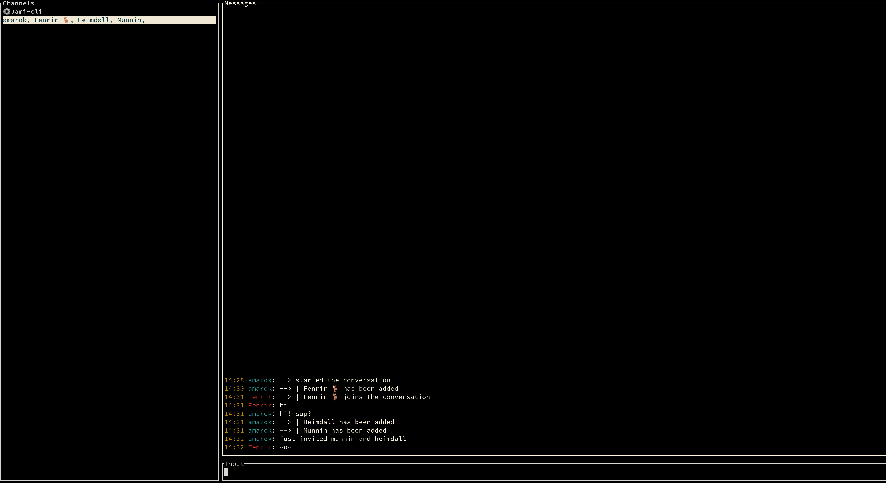
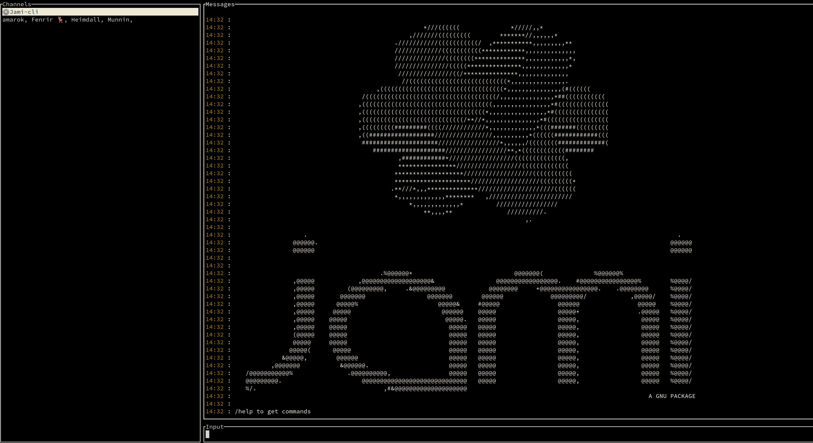

# Jami-Cli

[Jami](https://jami.net) client for terminal.

## Usage

This is a jami client done in Rust based on [Gurk](https://github.com/boxdot/gurk-rs). I did it to test swarm chat while developping this feature for Jami, so it's a client that will support Swarm chat, but will not support old conversations API. This feature doesn't exists yet in Jami, so just a few people will be able to use this client, but it can be modified for your needs and has account management. But if still interested, this is the current Epic related: https://git.jami.net/groups/savoirfairelinux/-/boards?scope=all&utf8=%E2%9C%93&state=opened&milestone_title=Swarm-chat

To run this project you will need:

+ The Jami daemon (cf https://jami.net) and install Jami. (Current status: you will need this stack: https://review.jami.net/q/topic:%22swarm%22+(status:open%20OR%20status:merged)) as the swarm feature is not available for now. This instructions can be useful (https://git.jami.net/savoirfairelinux/ring-project/wikis/technical/Build-instructions)
+ Install libdbus
+ `cargo install jami-cli`
+ Run `dring`
+ Run `jami-cli`
+ Enjoy!

## Features

+ Manage accounts (add/remove/link/import/change settings)
+ Contact lookups and profile receptions
+ Swarm:
  + Start a swarm
  + Remove a swarm
  + Invite someone to join a swarm
  + Receive invites for swarms
  + Join or decline an invite
  + Remove members
  + Send text messages
  + Show synchronized call messages and file transfers
  + Support swarm modes (1:1, admin invites only, invites only, public)
+ Room titles

## Missing features but wanted

+ Calls (without image, maybe in the future)
  + Start a call
  + Stop a call
  + Invite members
+ Scroll for messages
+ Auto-completion

## License

From gurk (original project):
 * Apache License, Version 2.0, ([LICENSE-APACHE](LICENSE-APACHE) or
   http://www.apache.org/licenses/LICENSE-2.0)
 * MIT License ([LICENSE-MIT](LICENSE-MIT) or
   http://opensource.org/licenses/MIT)

Jami is a GPLv3 project
