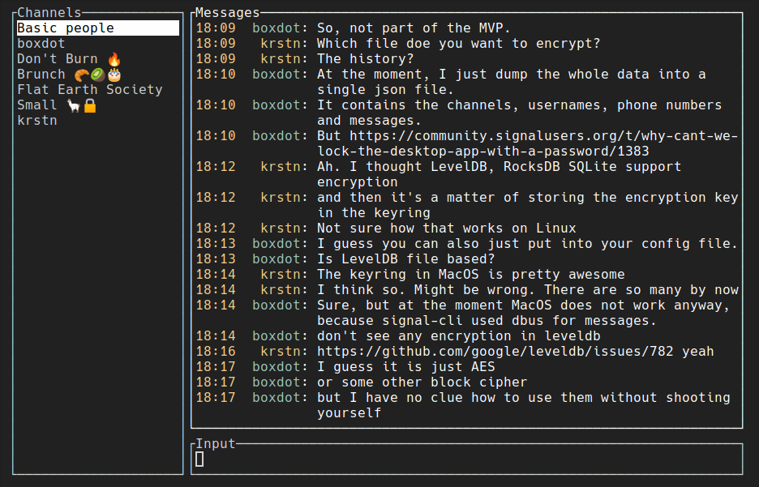

# gurk 🥒

[Signal Messenger] client for terminal.



## Usage

This crate cannot be installed from crates.io directly. It depends on the
official Rust implementation of [libsignal protocol], which is not published on
crates.io.

Either install the latest version via

```
cargo install --git https://github.com/boxdot/gurk-rs gurk
```

or download a pre-compiled binary from [Releases].

## License

 * Apache License, Version 2.0, ([LICENSE-APACHE](LICENSE-APACHE) or
   http://www.apache.org/licenses/LICENSE-2.0)
 * MIT License ([LICENSE-MIT](LICENSE-MIT) or
   http://opensource.org/licenses/MIT)

### Contribution

Unless you explicitly state otherwise, any contribution intentionally submitted
for inclusion in this document by you, as defined in the Apache-2.0 license,
shall be dual licensed as above, without any additional terms or conditions.

[Signal Messenger]: https://signal.org
[libsignal protocol]: https://github.com/signalapp/libsignal
[Releases]: https://github.com/boxdot/gurk-rs/releases
